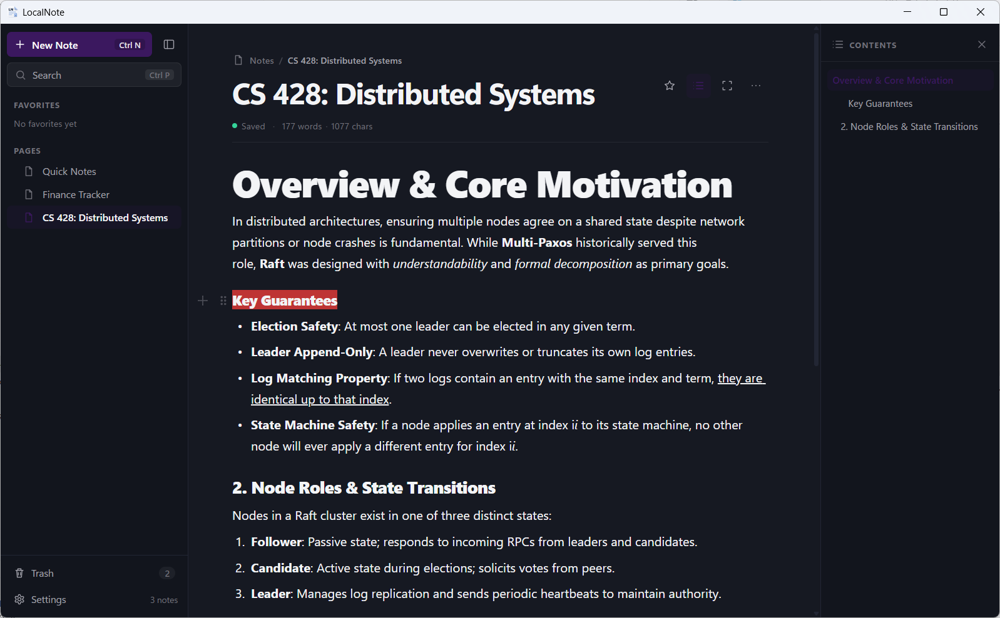
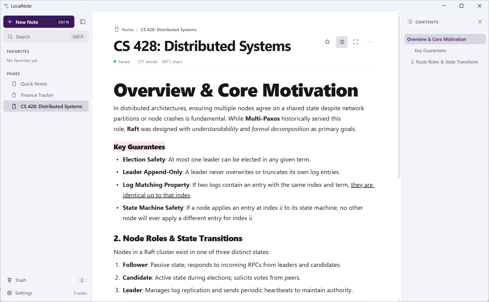
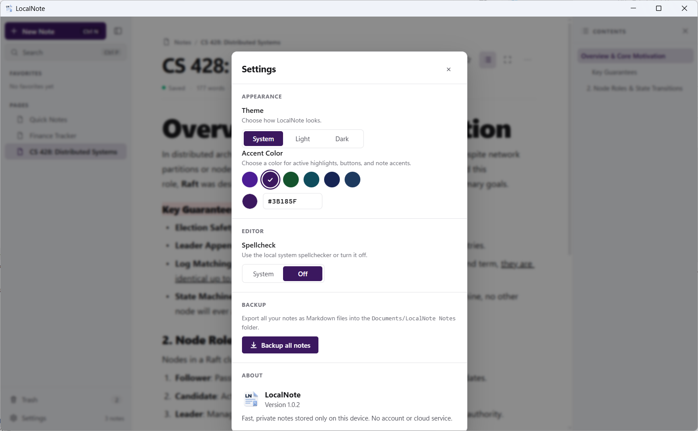
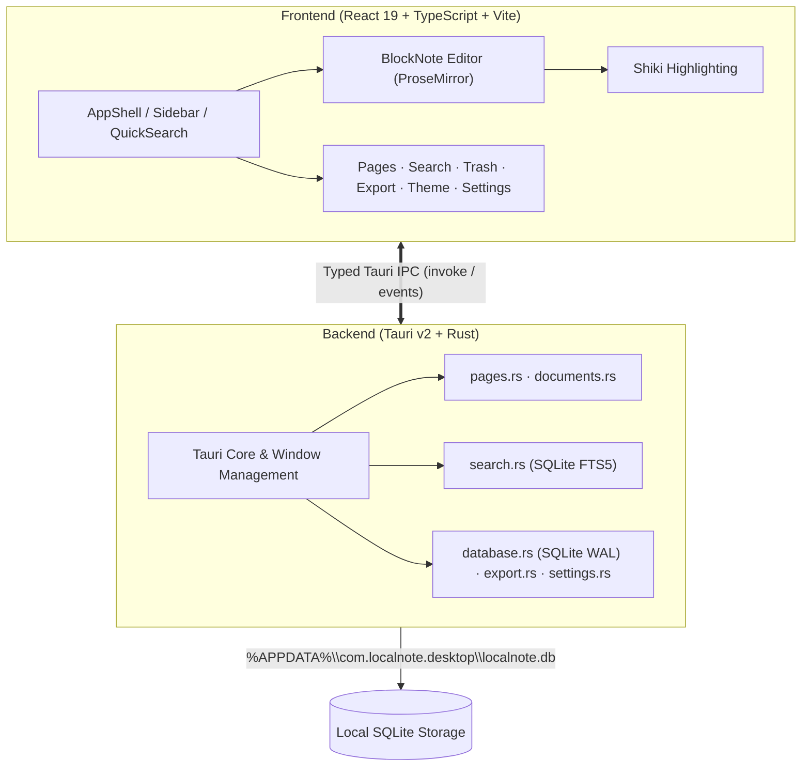

# LocalNote

<p align="center">
  <strong>A fast, private, and local-only desktop block-based note-taking application.</strong>
</p>

<p align="center">
  
</p>

<p align="center">
  
  
  
  
  
  
</p>

<p align="center">
  
</p>

---

## Overview

**LocalNote** is designed for one job: capturing and organizing your thoughts locally.

It brings the familiar, flexible block-based editing experience of modern productivity tools to your desktop—completely stripped of accounts, cloud syncing, telemetry, subscriptions, and remote server dependencies. Your notes, code snippets, and project plans are stored on your own machine in a high-performance embedded SQLite database, never leaving your device.

---

## Key Features

- ⚡ **Fast & Lightweight**: Powered by **Tauri v2** and **Rust** for minimal resource consumption, with all data stored in an embedded SQLite database running in WAL mode.
- 📝 **Block-Based Writing**: Rich block types — paragraphs, headings, bullet/numbered lists, checklists, blockquotes, and dividers — with **slash commands** (`/`), markdown shortcuts (`#`, `-`, `1.`, `>`, …), and drag handles for reordering and transformations.
- 🎨 **Code Syntax Highlighting**: Integrated **Shiki 4.4** engine with meticulously balanced soft-contrast palettes, supporting TypeScript, JavaScript, Python, Rust, HTML, CSS, SQL, Shell, JSON, and more without network calls.
- 🔍 **Instant Local Search**: **SQLite FTS5** full-text search across page titles and complete note contents with millisecond response times and keyboard-first navigation.
- 🗂️ **Hierarchy, Organization & Trash**: Deep multi-level nested pages with cycle prevention, favorites, and two-stage delete protection with a dedicated **Trash** surface for restore or permanent purge.
- 🎨 **Themes & Accent Palettes**: Light, Dark, and System themes, curated accent presets (Deep Purple, Royal Aubergine, Emerald Forest, Deep Teal, Midnight Navy, Slate Blue), and custom HEX color input.
- 🛡️ **Ironclad Data Safety**: Debounced autosave with a serialized write queue, flush-before-load page switching, window close protection, and non-destructive recovery that never silently wipes malformed documents.
- 📤 **Markdown Export**: Export any note to standard `.md` format with sanitized, OS-safe file naming.
- 🔒 **Private by Design**: Zero telemetry, analytics, authentication, or network APIs — fully functional offline, guarded by a strict CSP (`default-src 'self'`).

---

## Screenshots

<table align="center">
  <tr>
    <td align="center" width="50%">
      <strong>🌙 Dark Theme (Default)</strong><br />
      
    </td>
    <td align="center" width="50%">
      <strong>☀️ Light Theme</strong><br />
      
    </td>
  </tr>
</table>

<p align="center">
  <em>Distraction-free block editor, dynamic table of contents, breadcrumb trail, and live word/character counters.</em>
</p>

<br />

<p align="center">
  <strong>⚙️ Appearance & Settings</strong><br />
  <br />
  <em>Theme toggle, 6 curated accent color presets or custom HEX values, spellcheck setting, and 1-click Markdown backup.</em>
</p>

---

## Keyboard Shortcuts

| Shortcut | Action |
| :--- | :--- |
| <kbd>Ctrl</kbd> + <kbd>P</kbd> | Open Quick Search (FTS5 search across all notes) |
| <kbd>Ctrl</kbd> + <kbd>N</kbd> | Create a new page at the root level |
| <kbd>F2</kbd> | Rename active note or focused sidebar item |
| <kbd>Ctrl</kbd> + <kbd>\</kbd> | Collapse / Expand sidebar |
| <kbd>Ctrl</kbd> + <kbd>D</kbd> | Duplicate the active editor block |
| <kbd>Ctrl</kbd> + <kbd>B</kbd> / <kbd>I</kbd> / <kbd>U</kbd> | Toggle **bold** / *italic* / underline |
| <kbd>Ctrl</kbd> + <kbd>K</kbd> | Insert / edit link |
| <kbd>Ctrl</kbd> + <kbd>Z</kbd> | Undo |
| <kbd>Ctrl</kbd> + <kbd>Shift</kbd> + <kbd>Z</kbd> / <kbd>Ctrl</kbd> + <kbd>Y</kbd> | Redo |
| <kbd>/</kbd> | Open slash command palette |
| <kbd>Tab</kbd> / <kbd>Shift</kbd> + <kbd>Tab</kbd> | Indent / Unindent list items |
| <kbd>Enter</kbd> | Create new paragraph block |
| <kbd>Shift</kbd> + <kbd>Enter</kbd> | Insert soft line break within current block |
| <kbd>Esc</kbd> | Close search, popovers, or dialogs |

---

## Architecture & Tech Stack



- **Desktop Runtime**: [Tauri 2](https://v2.tauri.app/) (Rust + OS WebView2)
- **Frontend Framework**: [React 19](https://react.dev/) + [TypeScript](https://www.typescriptlang.org/) + [Vite](https://vite.dev/)
- **Editor Foundation**: [BlockNote 0.53](https://www.blocknotejs.org/) (ProseMirror architecture)
- **Syntax Highlighter**: [Shiki 4.4](https://shiki.style/) (local TextMate grammars)
- **Database & Storage**: Embedded [SQLite](https://sqlite.org/) with FTS5 and WAL mode via [`rusqlite`](https://github.com/rusqlite/rusqlite)
- **Test Suites**: [Vitest](https://vitest.dev/), React Testing Library, and Rust `cargo test`

---

## Project Structure

```text
LocalNote/
├── docs/                       # Documentation & media assets
│   └── screenshots/            # In-app application screenshots
├── public/                     # Static assets (App icon)
├── src/                        # Frontend React application
│   ├── app/
│   │   └── AppShell.tsx        # Top-level layout composition
│   ├── components/             # Shared UI components (TitleBar, ContextMenu, Tooltip, …)
│   ├── features/
│   │   ├── editor/             # BlockNote editor, slash menu, code blocks, save queue, TOC
│   │   ├── export/             # Markdown serialization & backup
│   │   ├── pages/              # Page hierarchy & management
│   │   ├── search/             # QuickSearch (FTS5) overlay
│   │   ├── settings/           # Settings dialog & spellcheck
│   │   ├── sidebar/            # Page tree, search box, favorites, sidebar state
│   │   ├── theme/              # Theme & accent color management
│   │   └── trash/              # Trash dialog (restore / purge)
│   ├── App.tsx                 # Main application component
│   ├── main.tsx                # React application entry point
│   └── styles.css              # Global styling
├── src-tauri/                  # Rust desktop backend
│   ├── src/
│   │   ├── database.rs         # SQLite connection, schema & migrations
│   │   ├── pages.rs            # Page hierarchy commands
│   │   ├── documents.rs        # Document persistence commands
│   │   ├── search.rs           # FTS5 full-text search commands
│   │   ├── export.rs           # Markdown export commands
│   │   ├── settings.rs         # App settings commands
│   │   ├── lib.rs              # Tauri application builder & plugin configuration
│   │   └── main.rs             # Tauri binary entry point
│   ├── Cargo.toml              # Rust dependencies & configuration
│   └── tauri.conf.json         # Tauri app, window & bundle settings
├── index.html                  # HTML shell
├── package.json                # Node.js scripts & frontend dependencies
├── LICENSE                     # PolyForm Noncommercial License 1.0.0
├── tsconfig.json               # TypeScript configuration
└── vite.config.ts              # Vite build configuration
```

---

## Getting Started

### Prerequisites

Ensure you have the following installed on your Windows machine:

1. **Windows 10 / 11** with Microsoft Edge WebView2 (pre-installed on modern Windows)
2. **[Node.js](https://nodejs.org/)** 20.19+ or 22.12+ LTS and `npm`
3. **[Rust stable toolchain](https://rustup.rs/)** (`x86_64-pc-windows-msvc`)
4. **[C++ Build Tools](https://visualstudio.microsoft.com/visual-cpp-build-tools/)** with the "Desktop development with C++" workload

### Installation

Download the latest release from the **[Releases](../../releases)** page:

- **`LocalNote_1.0.2_x64-setup.exe`**: Standard Windows installer (NSIS)
- **`localnote.exe`**: Portable standalone executable

### Development

1. **Clone the repository**:
   ```bash
   git clone https://github.com/your-username/LocalNote.git
   cd LocalNote
   ```

2. **Install dependencies**:
   ```bash
   npm install
   ```

3. **Launch in development mode**:
   ```bash
   npm run tauri dev
   ```

### Production Build

To generate an optimized release binary and Windows installer (NSIS):

```bash
npm run tauri build
```

The compiled binaries will be output to:
```text
src-tauri/target/release/localnote.exe
src-tauri/target/release/bundle/nsis/LocalNote_1.0.2_x64-setup.exe
```

---

## Testing & Quality

### Rust Backend Tests

Run the unit & stress test suite verifying database operations, hierarchy safety, and search reliability:

```bash
cargo test --manifest-path src-tauri/Cargo.toml
```

### Frontend Tests, Types & Lint

```bash
# Run frontend unit & reliability tests
npm run test -- --run

# Verify TypeScript types
npm run typecheck

# Run ESLint
npm run lint
```

---

## License

This project is licensed under the [PolyForm Noncommercial License 1.0.0](LICENSE).

> Required Notice: Emirhan Akdeniz, github.com/emirhanakdeniz

In short, this license permits any **noncommercial** use of LocalNote — including personal use, hobby projects, and use by charitable, educational, research, public safety/health, environmental, and governmental organizations — as well as changes and redistribution of the software for noncommercial purposes, provided that the license terms and the Required Notice above are passed along. Commercial use is not permitted under these terms; contact the licensor if you need a commercial license.
